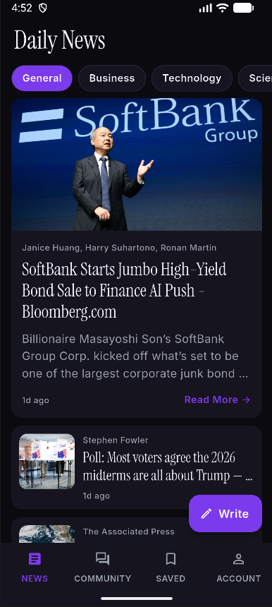
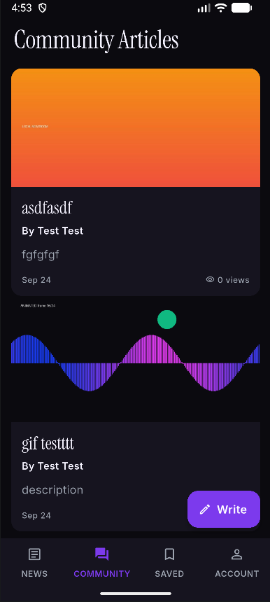
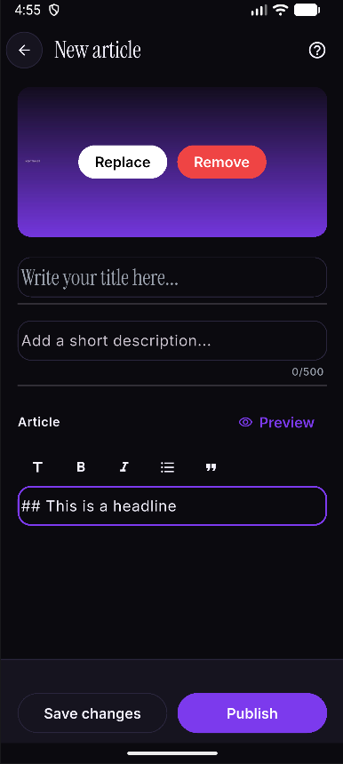
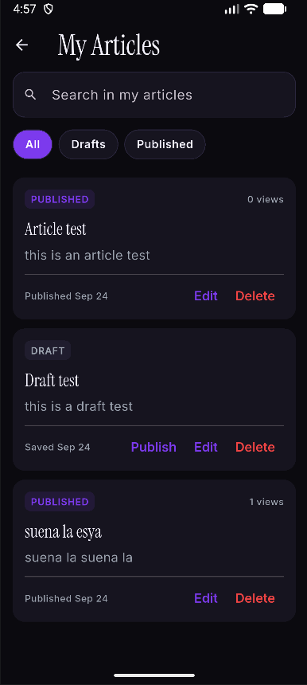
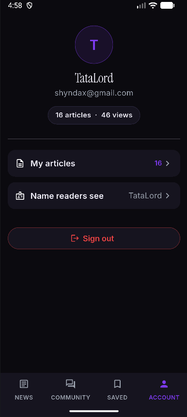
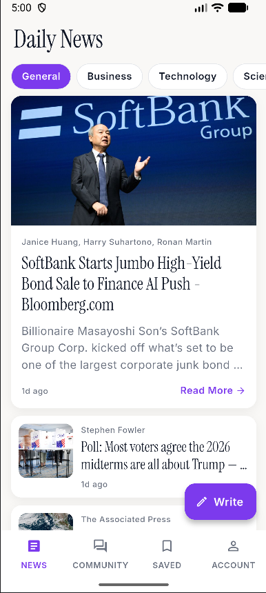
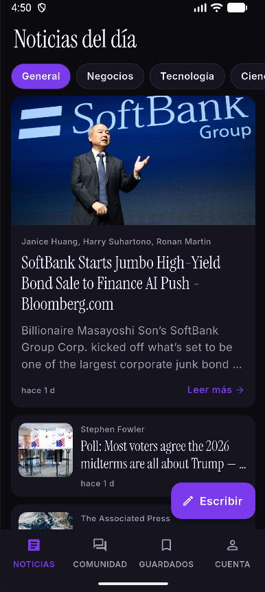
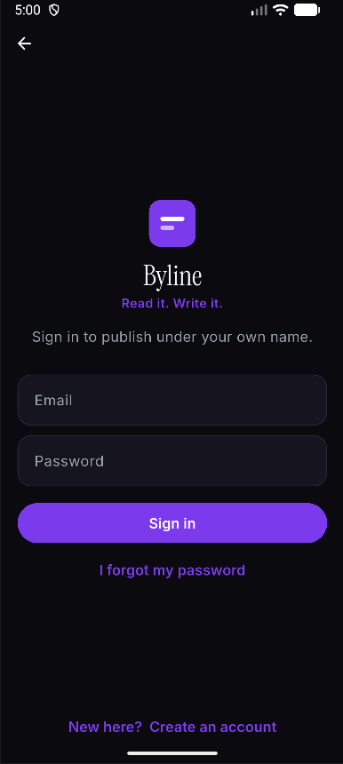

# Report — Byline

**Applicant Showcase App · Symmetry**
Author: TataLord · Built in ~72 hours

---

## A note before you start: `docs/DECISIONS.md`

This report tells the story. [`docs/DECISIONS.md`](./DECISIONS.md) is the
evidence behind it.

It is an engineering decision log I started on the first day and kept writing
until the last one — 89 numbered entries, in the order I made them. Every entry
answers the same three questions: what I decided, what I decided *against*, and
why. It covers the things the project documents do not prescribe: why the
journalist's article is a different entity from the news API's, why autosave
lives in a cubit rather than a use case, why the reset-password flow refuses to
say whether an address exists, why I kept Firestore's offline cache for reads
and put a deadline on writes.

I wrote it for two reasons.

The first is that I could not have held all of it in my head. By the second day
I was making decisions that contradicted ones from the first day, and writing
them down was the only way to notice.

The second is **Truth is King**. A reviewer reading this codebase will find
choices they would have made differently. I would rather they find my reasoning
next to the code than have to guess at it — including the reasoning that turned
out to be wrong, which is also in there. Decision #78 is a bug I diagnosed
confidently, fixed, and only then discovered I had fixed the wrong thing.
Decision #88 is a bug *I introduced* while fixing another one, which the
reviewer of this project — the person testing it — caught before I did.

Throughout this report I link to specific decisions like this: (#71). If
something here sounds like a claim, the number is where I show my work.

Two small things, since they will be visible:

- **Everything is in English** — the code, the comments, the documents, the
  commits, this report, and the videos. No language was specified, and my own
  is Spanish. I chose English because it is the language the repository I was
  handed is written in, and consistency seemed worth more than comfort.
- **The News API key is committed on purpose.** It came with the starter
  project and is a free developer key, and leaving it in means you can clone
  this repository and run it without setting anything up. It is flagged as a
  known issue in `core/constants/constants.dart` and in decision #69, because
  a committed key is still a committed key — I would not do this with a real
  one, and decision #49 covers which keys in this project actually matter.

---

## 1. Introduction

When I opened the repository, I felt two things at once: confusion, and real
expectation about how much I was about to learn.

My Flutter and Dart were basic. I had never worked with Clean Architecture in
any language, and I had never touched Firebase — my backend experience was
Oracle Cloud Infrastructure. So the honest summary of my starting position is
that I knew none of the three technologies this project is built on.

What I did not feel was discouragement. The README says the ideal candidate
does not know these technologies and learns them over 72 hours, and I read that
as an invitation rather than a warning. My first reaction was not "can I do
this" — it was to open a document and start mapping out what I would have to
understand, in what order, before I could write a single useful line. Getting
my head clear about the path was the thing that turned confusion into a plan.

I want to say plainly what I think I am handing in. This is not a project that
merely satisfies the brief. It is a project I like. There is a difference, and
it is the difference I care about most.

---

## 2. Learning Journey

The test started on a day when I had a commitment a few hours away. That
constraint turned out to be useful: instead of opening the editor and flailing,
I spent that first block deciding **what to learn** rather than trying to learn
it.

I built my syllabus out of the repository itself. The README links resources,
and the project documents (`APP_ARCHITECTURE.md`, `ARCHITECTURE_VIOLATIONS.md`,
`CODING_GUIDELINES.md`) describe the shape of the thing I was supposed to
build. Reading those first told me which of the linked resources I actually
needed.

**What I consumed, and where:**

- **Clean Architecture** — the Dev Branch tutorial linked in the README. This
  was the backbone: layers, `DataState`, dependency injection with `get_it`,
  the split between remote and local data sources.
- **BLoC** — Flutterly's series. Cubits versus blocs, states as values,
  the discipline of not putting logic in the UI.
- **Flutter, Dart and Firebase** — documentation and the linked playlists, in
  smaller pieces, as I hit things I did not understand.

Most of this happened in dead time — commutes, waiting, the gaps between other
obligations. I watched the architecture and BLoC material **several times
over**, which sounds inefficient and was not. The first pass told me what the
words meant. The second pass told me what I still did not understand. That
second list is what made the rest of my learning targeted instead of vague: I
took my specific questions to Gemini and pushed on them until the answers
actually connected, rather than re-watching a video hoping it would land.

Then I kept learning while building. I never stopped reading about Flutter,
Dart, Firebase and the architecture during the whole ~72 hours, and that
mattered for a specific reason.

**On how I wrote the code, and why the learning had to be real.** I used Claude
as a programming partner to move fast under a hard deadline. I want to be
direct about that, because the value in this project is not in the typing — it
is in the judgment applied to it, and judgment is the part I had to earn.

Understanding the architecture well enough to *steer* it is what made that
collaboration worth anything. There were plenty of moments where the fastest
implementation was not the one `ARCHITECTURE_VIOLATIONS.md` allows: a widget
reaching for a repository, a Firebase type escaping `data_sources`, business
logic settling into a cubit. Catching those needed me to actually know the
rules and to recognise the drift when it started. Several decisions in the log
are exactly that — #63 is a pass where I found provider SDKs leaking out of the
data layer and pushed them back in; #65 is business logic that had quietly
moved into a cubit; #67 is what I did about it so it could not happen again.

The same applies to the technologies. Knowing what Firestore's security rules
can and cannot express is what let me design a schema the rules could actually
enforce (#34). Knowing how Firestore treats an offline write is what turned
five separate bug reports into one root cause (#71). None of that comes from
accepting generated code — it comes from understanding the tool well enough to
ask the right question.

So the honest description is: I learned the technologies to the point where I
could direct the work, recognise when it was going wrong, and defend every
decision in it. That is the skill I think this exercise is really testing, and
it is the one I tried to demonstrate.

---

## 3. Challenges Faced

The hard part of this project was not the code.

I expected to get stuck — on Firestore, on some feature I could not make work,
on the architecture. That mostly did not happen. When I hit walls they were
usually sharp and solvable: a Firebase plugin bug that decoded the wrong shape
and forced a version upgrade (#39), a code generator I could not run because
two dependencies pinned incompatible analyzer versions (#19), the starter
project not building as delivered on a current toolchain (#15).

The real challenge was **building something I actually liked, in technologies I
had never used, in a window that kept shrinking.**

Commitments I could not move took a large share of the first 48 hours. That
left me with a genuine problem: the bar I wanted to clear was not "it works",
and the time available was closer to "make it work". Those are different
projects.

What got me through it was mostly organisation, and I had done this before.
When I built **PROSCAN** I worked under similar conditions — a project I cared
about, squeezed into time I did not really have — so I knew the shape of the
problem. I split the work by what it needed from me: learning went into dead
time, where a video or documentation is all you can do anyway; building went
into deliberately protected blocks where I could hold the whole thing in my
head. I planned what I would attempt in each block before it started, so that
the block was spent building rather than deciding.

It worked out better than I expected. I dropped exactly one personal habit for
those days and did not drop any of my other responsibilities — and I still got
the project to a point I am happy with rather than a point I could defend.

The lesson I am taking is not about time management in the abstract. It is that
a deadline does not have to mean lowering the bar; it usually means being
honest much earlier about what is essential, and then protecting the time to do
that part properly. `docs/DECISIONS.md` has a *Pending work* table at the end
listing what I consciously left open — that table is the shape of those
decisions, written down rather than hidden.

---

## 4. Reflection and Future Directions

This was a genuinely great project to work on, and I mean that about the
experience and not just the outcome.

**Clean Architecture** is the thing I most want to keep. Before this I would
have called a project "well organised" if the folders were tidy. What I learned
here is that the layers are a set of *rules about dependencies* — that the
domain layer knowing nothing about Firebase is what let me swap an in-memory
repository for a Firestore one by changing two lines in the injection container
(#6), and what let me test the whole business layer without a network. I will
carry that into every Flutter project I build from here.

The **coding guidelines** surprised me in the same way. Rules like "functions
do one thing" and "no more than two levels of nesting" sound like style until
you are reading your own code from two days ago at speed. I now read
`CODING_GUIDELINES.md` less as a checklist and more as a description of code
that is cheap to come back to.

**Firebase** I liked a lot. Coming from OCI, the difference is startling: I had
authentication, a database, file storage and enforceable security rules running
in an afternoon. Security rules in particular were a small revelation — being
able to express "the author may edit this, and any reader may increase its view
count by exactly one, and nothing else" *in the database itself* is a much
stronger guarantee than trusting the client. For small and medium projects I
will reach for it again without hesitating.

**Flutter** is one of the frameworks I most wanted to learn on my way to
specialising in mobile, and I enjoyed it more than I expected. I spent real
time playing with widgets and animations past the point of necessity, which is
usually how I know I like something.

Professionally, the part I value most is what this simulated. I was handed an
existing codebase, a set of architectural rules, a contribution guide and a
brief — and told to extend it without breaking any of that, while being allowed
to argue for changes when I could justify them. That is much closer to
professional work than anything I had built alone before, and it is a good sign
about the direction I want to go.

### Ideas for where the project goes next

Ordered by what I think would matter most to an actual reader or writer:

1. **A read path that does not depend on being online.** Saved articles already
   live in a local database and survive with no connection; community articles
   come from Firestore's cache and therefore only survive if you happened to
   load them. Making "save for later" work for community articles too — the one
   thing the current design offers and the data layer cannot yet do (#44, and
   *Pending work* item 5b) — would make the whole app coherent offline.
2. **Following an author.** The app already has author pages and view counts;
   the missing piece is a reason to come back. A follow list and a feed built
   from it is a small schema change and a large product change.
3. **Comments, or any reader-to-writer signal.** Right now a journalist knows
   how many people opened an article and nothing else. A view count is the
   weakest possible feedback.
4. **Images inside the article body**, not just a cover. The Markdown editor is
   already there; this is mostly an upload flow and a storage path.
5. **Scheduled publishing.** The draft/published lifecycle and `publishedAt`
   already exist (#42), so "publish on Thursday at 7am" is a Cloud Function and
   a date picker rather than a redesign.
6. **Security-rules unit tests.** Less visible than the rest and, in my
   judgment, the biggest verification gap in the project: the rules are
   deployed and known to compile, but nothing proves they allow and deny
   exactly what they claim. It is *Pending work* item 2 for that reason.

---

## 5. Proof of the Project

This section shows the app doing what the assignment asked for: reading the
news, and a journalist publishing their own articles. Everything beyond that is
in [section 6](#6-overdelivery).

### Showcase video

**[▶ Watch the showcase][video-showcase]** · ~5 min

A single pass through the core journey, with no account at the start and a
published article at the end:

1. Cold start into the news feed — no sign-in wall, reading is free
2. Browsing categories, refreshing, opening an article, saving it for later
3. Creating an account
4. Writing an article: cover image, headline, standfirst, body
5. Publishing it, and the confirmation that follows
6. The article appearing in the community feed, and in *My articles*

### Screenshots

Shot in dark mode, which is how I use the app — the seventh is the same feed on
a device set to light, so the pair shows the theme actually following the
system rather than being painted once.

| | | |
|---|---|---|
|  |  |  |
| **Daily News** — the feed, with a lead card and category chips | **Reader** — one article, savable for later | **Community** — what journalists have published |
|  |  |  |
| **Editor** — a page to write on, not a form to fill in | **My articles** — drafts and published work, with every action | **Account** — who you are and what you have written |
|  |  |  |
| **Light mode** — the same feed, on a device set to light (#60) | **Spanish** — on a Spanish device (#59) | **Sign in** — the front door |

---

## 6. Overdelivery

The assignment was: *let a journalist upload their own articles*. Everything
below is something I added because the app felt incomplete without it, or
because I wanted to.

I have grouped the extras into five short videos rather than one long one, so
each can be watched on its own.

### 6.1 New features implemented

#### A. Reading is a first-class path, with no account

**[▶ Watch][video-reading]** · ~2 min · Decisions #21, #31, #43, #44

The brief covered uploading. It did not cover anyone *reading* what was
uploaded, and an article nobody can read is not published — it is stored. So I
built the public side:

- A **community feed** of everything journalists have published, most recent
  first, paginated ten at a time over a rolling seven-day window (#43)
- **Author pages** — a byline leads to that author's whole back catalogue, and
  a "More from ⟨author⟩" strip sits at the foot of every article
- **View counts**, incremented once per read, by anyone, including signed-out
  readers — and deliberately *not* treated as an edit, so being read does not
  reorder the feed or change the article's "last edited" date (#24)
- **Reading never requires an account** (#31). The sign-in screen exists for
  people who want to write

#### B. The writing experience

**[▶ Watch][video-writing]** · ~3 min · Decisions #26, #40, #52, #53, #54, #55

The editor is the screen a journalist actually lives in, so it got the most
attention:

- **Markdown with a toolbar and a live preview** (#53). Markdown is only
  friendly to someone who can see what it turns into, so the toolbar writes the
  syntax and the preview shows the result
- **A guided tour** that highlights the real controls on the real screen, in
  five steps, and *demonstrates* the formatting rather than describing it (#54)
- **Autosave for drafts**, debounced two seconds after you stop typing — and
  deliberately never for a published article, because silently rewriting what
  readers already have is not a feature (#26, #40)
- **Work stopped being losable** (#55): leaving with unsaved changes asks, and
  the answer that destroys work is the harder target to hit (#56)
- **Cover images** picked from the gallery, compressed to the size they are
  displayed at — except animated GIFs, which skip compression so they are not
  silently flattened into a still frame (#52)

#### C. Owning your work: full CRUD, drafts and a workspace

**[▶ Watch][video-crud]** · ~2.5 min · Decisions #42, #47, #50, #57, #79

The brief asked for upload. Articles have a life longer than that:

- **Create, read, update, delete**, plus a **draft/published lifecycle**
- ***My articles*** — one workspace with search across title, description and
  body, filters by status, and every action spelled out in words rather than
  hidden behind a swipe
- **Editing is not republishing** (#42). An edit keeps the publication date and
  the view count, so it does not jump the article back to the top of the feed
- **The name readers see can be changed** (#57) — and changing it **rewrites
  the byline on everything already published** (#79), in one batch, without
  touching any article's date or view count
- **An account summary** of articles written and total views (#47)

#### D. Accounts, and the security behind them

**[▶ Watch][video-accounts]** · ~2.5 min · Decisions #29–#34, #41

Authentication was not in the brief. It became unavoidable the moment the
security rules needed to know who owned an article (#29):

- **Email and password sign-up and sign-in**, with every rule checked on the
  device before anything reaches the network
- **Password reset** by email
- **Anti-enumeration throughout** (#41): a wrong password and an unregistered
  address produce the *same* message, word for word, and a reset request
  confirms identically whether or not the address exists. The app cannot be
  used to find out who has an account here
- **Ownership enforced in the database, not the client**
  ([`backend/firestore.rules`](../backend/firestore.rules)): only the author
  may edit or delete an article, and any reader may raise its view count by
  exactly one and change nothing else
- **Storage rules that check content type as well as size**, so the article
  media folder can only ever hold images

#### E. Everything that is not the happy path

**[▶ Watch][video-resilience]** · ~3 min · Decisions #59, #60, #71, #72, #76

This is the group I am proudest of, because it is the part users only notice
when it is missing:

- **Light and dark themes**, following the system setting, on every screen,
  repainting live when it changes (#60)
- **Spanish and English**, chosen from the device's language (#59, #82) —
  interface only, never the articles themselves
- **Offline behaviour that is actually designed** (#71, #73): saved articles
  live in a local database and work on a plane; community articles come from
  Firestore's cache; and every *write* has a deadline, so the app tells you it
  could not reach the server instead of spinning forever
- **"No connection" is its own error** (#72), rather than "Something went
  wrong" — the one failure the person can actually fix
- **One message per failure** (#76), in a banner that stays until it is dealt
  with, with an icon so the meaning does not rest on colour alone, announced as
  a live region to screen readers
- **Text scaling and small screens**: every form scrolls, nothing is clipped at
  200% system font

#### F. Engineering work with no screen to show

No video — the evidence is in the repository and in [section 7](#7-extra-sections):

- **`ARCHITECTURE_VIOLATIONS.md` made executable** (#67).
  [`test/architecture_test.dart`](../frontend/test/architecture_test.dart) is a
  test suite that fails the build if the data layer imports the presentation
  layer, if a provider SDK escapes `data_sources`, if a model does not extend
  an entity, and more. The architecture rules are no longer a document people
  are expected to remember
- **433 automated tests**, including a ceiling on how many source files may
  still lack a mirrored test — a number designed to go down and never up
- **A written manual QA plan of 172 checks**, walked end to end on a device
- **`docs/DECISIONS.md`** — 89 decisions, the reasoning behind all of it
- **The app has a name and an identity** (#84): *Byline* — the line under a
  piece of writing that says who wrote it, which is exactly what this
  assignment added. The mark is drawn in code and in
  [`assets/branding/app_icon.svg`](../frontend/assets/branding/app_icon.svg),
  one source for both the in-app logo and the launcher icon

### 6.2 Prototypes created

| Prototype | What it is | Where |
|---|---|---|
| **Database schema** | The Firestore `articles` schema, designed from the shape of the data the existing News API returns, with every field's purpose and constraints — and mirrored in the security rules so the documented schema is guaranteed rather than merely respected | [`backend/docs/DB_SCHEMA.md`](../backend/docs/DB_SCHEMA.md) |
| **Design system** | Typography, colour, spacing and elevation specs, implemented as code in `config/theme/design_tokens.dart` so the design has one source of truth on both sides | [`docs/FRONTEND_DESIGN.md`](./FRONTEND_DESIGN.md) |
| **Figma design brief** | A complete brief for redesigning the app's UI — every screen, state and string, written to fit the app that exists rather than requiring the app to be rebuilt around a design. It also argues one navigation change: the app bar's four unlabelled icons become a labelled bottom bar, because unlabelled icons fail the README's own "90 year old grandmother" test | [`docs/FIGMA_PROMPT.md`](./FIGMA_PROMPT.md) |
| **In-memory backend** | A complete implementation of the article repository contract that runs the whole app with no Firebase and no network. Built during the domain stage so the use cases could be developed against mock data (#6), and deliberately *kept* afterwards as a fixture | [`journalist_article_repository_in_memory_impl.dart`](../frontend/lib/features/journalist_articles/data/repository/journalist_article_repository_in_memory_impl.dart) |
| **Executable architecture rules** | `ARCHITECTURE_VIOLATIONS.md` turned into a test suite (#67) | [`test/architecture_test.dart`](../frontend/test/architecture_test.dart) |

**To run any of this locally:** `flutter pub get && flutter test` for the test
suites, and `flutter run` for the app. The in-memory backend swaps in by
changing two registrations in
[`injection_container.dart`](../frontend/lib/injection_container.dart), which
is the point decision #6 was making.

### 6.3 How I could improve this

Honestly, in order:

1. **The design deviates from the Figma prototype, and I should say so
   plainly.** The brief pointed at an existing high-fidelity prototype. I built
   my own design system instead, because the prototype covers three screens and
   this app has twelve, and extending it consistently would have meant
   guessing at its rules anyway. I wrote those rules down explicitly
   (`FRONTEND_DESIGN.md`) and produced a brief for bringing the Figma up to the
   finished app (`FIGMA_PROMPT.md`) — but I want to be clear that this was my
   call, not the brief's, and a reviewer is entitled to disagree with it.
2. **The security rules are not tested.** Everything else in this project has a
   test. The rules — the part that actually protects users' data — are
   verified only by having used the app. `@firebase/rules-unit-testing` exists
   and I ran out of time.
3. **There is no integration test.** 433 unit and widget tests, and zero tests
   that drive the real app against a real (emulated) backend. The manual QA
   pass covered that gap by hand, which does not scale.
4. **The overdelivery is broad rather than deep.** I would rather have shipped
   following-an-author end to end than three smaller things — but I did not
   know, on day one, which extras would fit in the time.
5. **Two known bugs are still open** and I did not hide them: the password
   reset link (which is Firebase's to mint and consume, not the app's — #87)
   and a launch-screen hang on a live language change that I could not
   reproduce from the code and therefore refused to claim as fixed (#82).

---

## 7. Extra Sections

### 7.1 The test suite

433 tests, in 65 files, mirroring the source tree file for file.

| Area | Test files |
|---|---:|
| `journalist_articles` (the new feature) | 31 |
| `daily_news` (the existing feature) | 13 |
| `authentication` | 12 |
| `shared` UI | 5 |
| `architecture`, `config`, `core`, `l10n` | 4 |
| **Total** | **65** |

Roughly 7,500 lines of test against 14,300 lines of source (excluding generated
code).

Two things about this suite are worth more than the number:

**The architecture test.**
[`test/architecture_test.dart`](../frontend/test/architecture_test.dart) turns
`ARCHITECTURE_VIOLATIONS.md` into assertions — data layer imports, provider
SDKs escaping `data_sources`, models not extending entities, repository
implementations not named `{Interface}Impl`, and whether `test/` still mirrors
`lib/`. Two rules are deliberately *not* tested ("no business logic in blocs",
"widgets should be reusable") because any test claiming to check them would be
checking a proxy, and a test that lies is worse than prose that is honest
(#67).

**The tests that were checked against the bug first.** Two of the newest tests
— the snack bar's lifetime and the account row's right edge — I ran against the
broken behaviour *before* keeping them, to confirm they actually failed. A
layout test that cannot fail is furniture (#88). One of them caught me writing
exactly that: the first test I wrote for a display-name overflow passed both
before and after the fix.

### 7.2 The manual QA pass

Near the end I stopped building and walked the entire app against a written
plan of **172 checks**, organised by flow, each naming what to do and what
should happen.

| Result | Count |
|---|---:|
| Passed | 154 |
| Failed | 10 |
| Blocked (could not be tested) | 8 |

The ten failures are fixed, and each is argued in decisions #71–#88 against the
id of the check that caught it.

What this was worth: **five of the ten reports turned out to be one bug.**
Publishing hanging on "Saving…", a cover image spinning with no message, an
image appearing on its own minutes after airplane mode was switched off,
"Something went wrong" on a new article, and the editor's buttons going
permanently dead — all of it was Firestore not failing a write made offline. It
queues the write and leaves the future pending, possibly forever. Fixing the
five reports one at a time would have produced five patches and no
understanding (#71).

Writing the expectations down *before* running them is what made the failures
usable. "The app feels slow" is not a bug report. "N-01: publish in airplane
mode — expect a failure message; observed: stayed on *Saving…* forever" is.

### 7.3 Known limitations

Stated here rather than left to be discovered. The full list is the *Pending
work* table at the end of [`docs/DECISIONS.md`](./DECISIONS.md).

- **The password reset link does not work.** Firebase mints and consumes it; no
  app code is involved. The likely causes are that only the most recent link
  per address is valid, or an email scanner burning the one-time code before
  the user clicks it. Diagnosed, not fixed (#87)
- **A live language change can hang the launch screen.** I hardened the one
  cause that fits the symptom, but I could not reproduce it from the code and
  will not call a mitigation a fix (#82, #83)
- **A Firestore write reported as failed may still land later.** The SDK owns
  the offline queue and offers no way to withdraw a pending write (#71)
- **Code generation cannot run** in this project — `floor_generator` and
  `retrofit_generator` pin incompatible analyzer versions — which constrains
  two things I would otherwise have changed (#19, #69)
- **Security rules have no unit tests** (*Pending work* item 2)

### 7.4 Running it yourself

```bash
git clone <this repository>
cd frontend
flutter pub get
flutter run          # the app
flutter test         # 433 tests
flutter analyze      # static analysis
```

No setup, no keys to obtain, no `.env` to fill in: the Firebase configuration
and the News API developer key are committed so that this clones and runs. See
the note at the top of this report about why, and decision #49 about which keys
in this project actually matter.

---

<!--
  Paste your links here once, and every reference above updates.
-->
[video-showcase]: https://youtu.be/-oCKz94TtE0
[video-reading]: https://youtu.be/KMnutDcLZLQ
[video-writing]: https://youtu.be/mEnef6TD5HU
[video-crud]: https://youtu.be/R08XgDz2QAk
[video-accounts]: https://youtu.be/hzTApmiW2mU
[video-resilience]: https://youtu.be/nhFV0TkENPE
